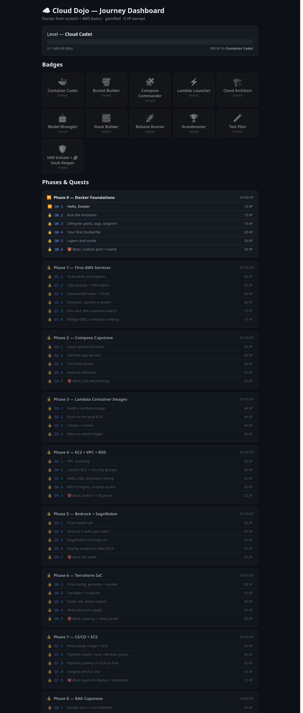
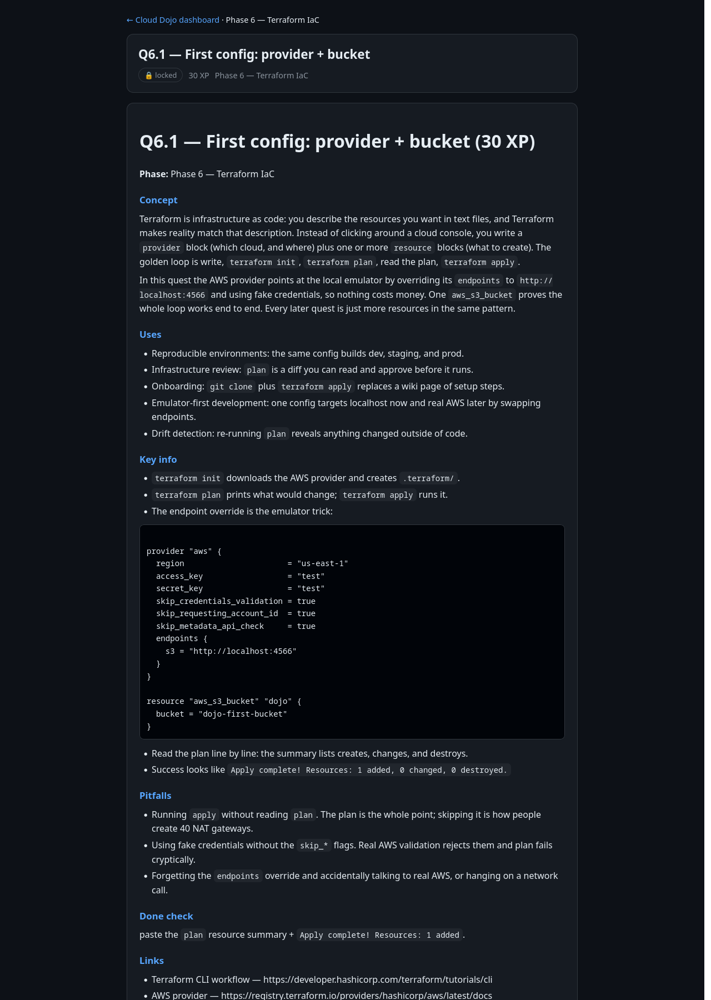

# ☁️ Cloud Dojo — Docker from scratch + AWS basics (gamified)

Learn Docker by running AWS itself — locally, free, no AWS account needed.



*Track 1600 XP across 8 phases on the dashboard — every quest title opens a concept page like this:*



## Start here
1. Read `GAME-RULES.md` (2 min) — XP, levels, badges.
2. Read `ROADMAP.md` (5 min) — all 4 phases + the parallel IAM track.
3. Track yourself with `python3 shared/progress.py` — interactive check menu
   (`status`, `check Q0.1`, `uncheck Q0.1`, `reset`); it updates the dashboard for you.
4. **We begin at Phase 0 together when you say go.** Nothing is started yet.

## The map
| Phase | Folder | XP | Status |
|---|---|---|---|
| 0 — Docker foundations | `phase-00-docker-foundations/` | 100 | 🔒 locked |
| 1 — First AWS services | `phase-01-aws-first-services/` | 150 | 🔒 locked |
| 2 — Compose capstone | `phase-02-compose/` | 150 | 🔒 locked |
| 3 — Lambda container images | `phase-03-lambda-images/` | 150 | 🔒 locked |
| T — Real-AWS track (IAM/billing) | `track-iam-sandbox/` | 200 | 🔒 locked |
| 6 — Terraform IaC | `phase-06-terraform-iac/` | 150 | 🔒 locked |
| 7 — CI/CD + ECS | `phase-07-cicd-ecs/` | 150 | 🔒 locked |
| 8 — RAG capstone (final) | `phase-08-rag-capstone/` | 200 | 🔒 locked |
| M — Moto testing (standalone) | `module-moto-testing/` | 50 | 🔒 locked |
| 4 — EC2 + VPC + RDS | `phase-04-ec2-vpc-rds/` | 150 | 🔒 locked |
| 5 — Bedrock + SageMaker | `phase-05-bedrock-sagemaker/` | 150 | 🔒 locked |

## 📊 Journey dashboard
Open `dashboard.html` in your browser — XP bar, level, badges, and every quest.
It's generated from `shared/progress.json`: update that file, then re-run
`python3 shared/render_dashboard.py` to refresh.

## Prerequisites (install before Phase 0)
- Docker (Desktop on Mac/Windows, Engine on Linux)
- AWS CLI v2 (`aws --version`)
- `curl`

## Playground health check
```bash
bash shared/check.sh
```

## The one-sentence mental model
Your app talks to `http://localhost:4566` from your laptop,
but to `http://emulator:4566` from inside a container —
that single distinction is half of this entire course.
