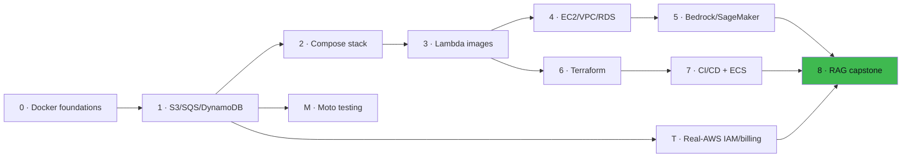
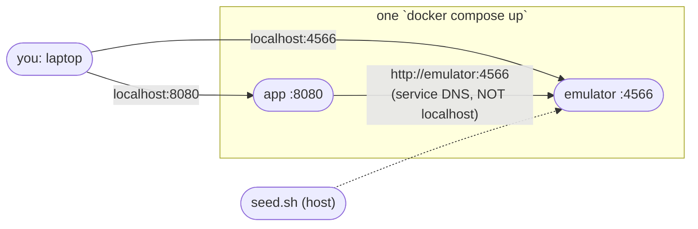
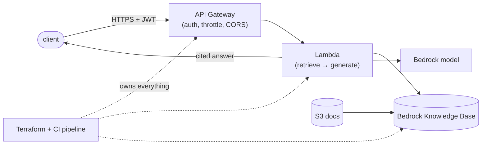
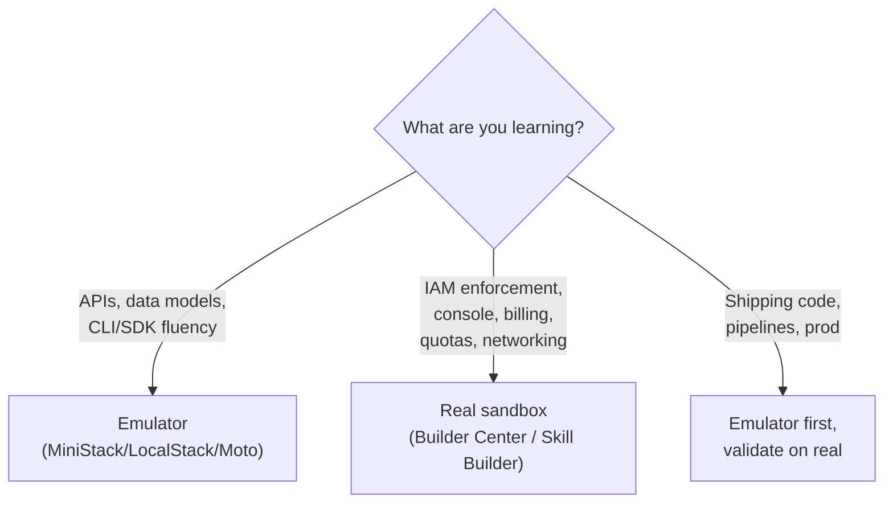

# Architecture Maps (rendered natively by GitHub)

## The journey: phases → capstone

## Phase 2 stack: who talks to whom

## Capstone (Phase 8): request path

## Emulator vs real AWS: what to practice where

